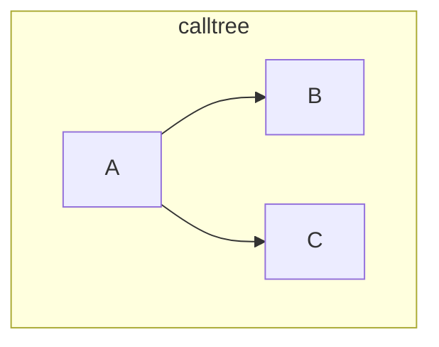
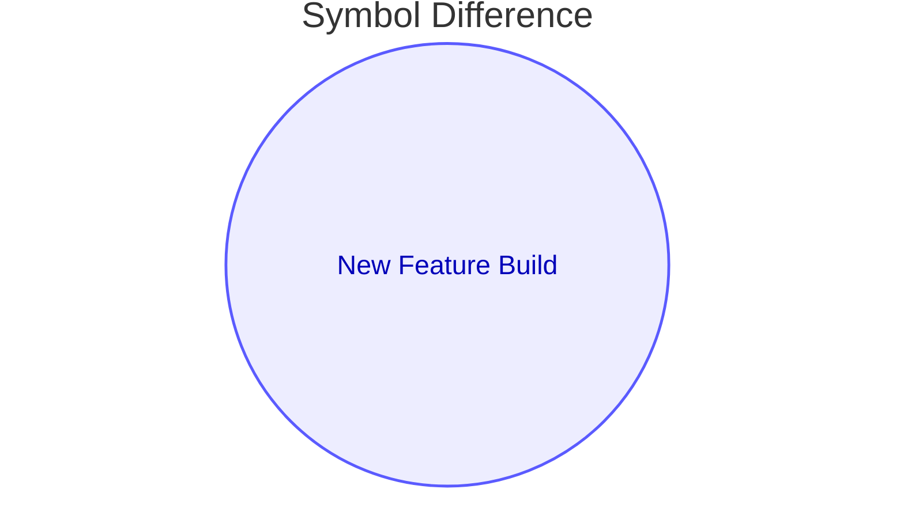
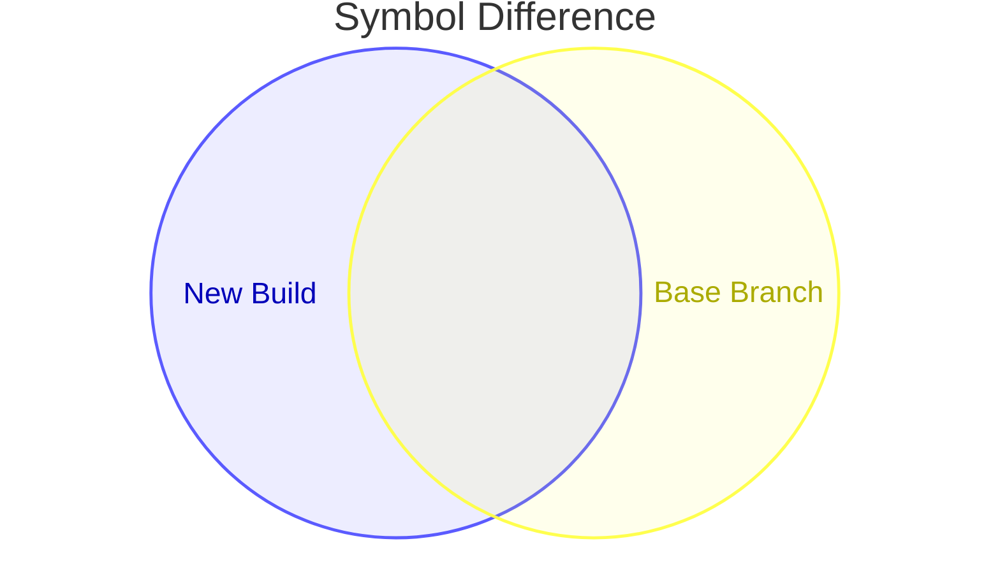
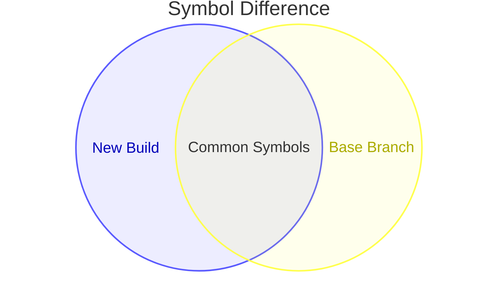
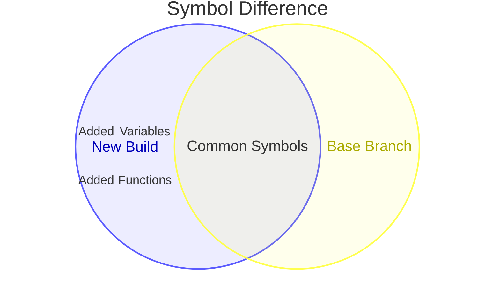
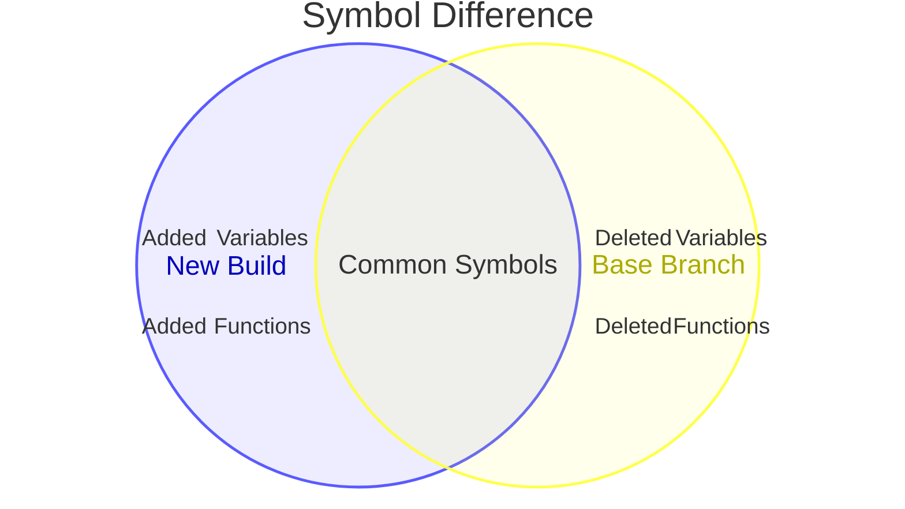
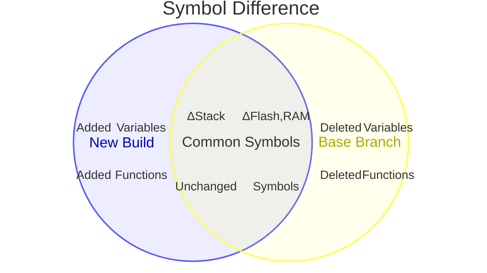

* TODO:
* how we get to the stack estimation - 20 minutes

---
title: Tool comparison
---

### Tool comparison

Not one tool to rule it all... <v-click at="4"> <b> yet - feedback and help welcome :) </b></v-click>

<small>

| Feature                         | pexplorer+sELFperf              | puncover             | avstack.pl           | dashboard+<span style="font-size:0.6rem">ROM/RAM</span> report                                                    |
|---------------------------------|---------------------------------|----------------------|----------------------|---------------------------------------------------------------------|
| **Development**                 | 2025-now                        | 2014-now             | 2013-2015            | 2017-now                      |
| **User interface**              | CLI + static web GUI | CLI + web GUI        | CLI                  |  CLI + web GUI      |
| **Memory footprint**            | <v-click at="1"> flash and RAM                                </v-click>    | <v-click at="1"> flash and RAM    </v-click>     | <v-click at="1"> -            </v-click> | <v-click at="1"> flash and RAM              </v-click>    |
| **Diff tool**                   | <v-click at="2"> web GUI combined for<br>flash, RAM and stack </v-click>    | <v-click at="2"> -                </v-click>     | <v-click at="2"> -            </v-click> | <v-click at="2"> CLI, separate for ROM and RAM </v-click> |
| **Firmware scope**              | <v-click at="2"> multiple                                     </v-click>    | <v-click at="2"> single           </v-click>     | <v-click at="2"> single       </v-click> | <v-click at="2"> (multiple with grafana)                                </v-click>     |
| **Stack usage**                 | <v-click at="3"> <b>parsing ASM✨ </b>                                  </v-click>    | <v-click at="3"> GCC .su files    </v-click>     | <v-click at="3"> parsing ASM  </v-click> | <v-click at="3">     -                          </v-click>         |
| **Call tree construction**      | <v-click at="3"> parsing ASM                                  </v-click>    | <v-click at="3"> parsing ASM <br> <b>GCC .ci files✨ </b><br> <b>dynamic call files ✨ </b> </v-click>  | <v-click at="3"> parsing ASM </v-click>   | <v-click at="3">  -    </v-click>   |
| **RTOS awarness**               | <v-click at="3"> <b>static thread detection✨ </b>                      </v-click>    | <v-click at="3"> -                 </v-click>    | <v-click at="3"> -             </v-click> | <v-click at="3">  (nothing memory related)    </v-click>     |
| **Supported architecture**      | <v-click at="3"> ARM / all*                                   </v-click>    | <v-click at="3"> ARM+limited RISCV <br> -> <b>all*✨ </b></v-click>    | <v-click at="3"> all           </v-click> | <v-click at="3"> all                          </v-click>  |

*only all architectures for memory footprint at the moment


</small>

<!--
| **Interrupt analysis**          | -                               | -                    | -                    |                                             |
including manually added dynamic calls
-->

<style>
    .slidev-layout td, .slidev-layout th {
        padding: 0.2rem;
        padding-top: 0.25rem;
        padding-bottom: 0.25rem;
    }
</style>

<!--
* for some context here an overview of tools
* the 3 tools on the left are integrated in zepyhr
* pexplorer and static ELF perf are experiments helped me get warm with the topic
* there is multiple functions
    * mem footprint mentioned as a big one
    * comparing changes across build another one
* but today is all about the stacks :)
* now we gonna show some of the highlighted topics
-->

---
layout: top-title-two-cols
color: dark
title: 'Getting the call graph'
---

:: title ::

### Getting the stack sizes - via GCC -fstack-usage

:: left ::

<small style="font-size:70%">Example from [Compile-time stack requirements analysis with GCC](https://www.adacore.com/papers/compile-time-stack-requirements-analysis-with-gcc)</small>

```c
#include <alloca.h>
static void foo (void) { char buffer [1024]; }
static void bar (int n) { void * buffer = alloca (n); }
int main (void) { return 0; }
```


* using ` -fstack-usage` for each compilation unit (.c file) a stack usage (.su) file is generated during compilation next to the object file
* listing all functions in the file and their stack size and wheater it is a limited or static size known during compile time

<small style="font-size:70;padding-top:0px">Example .su file:</small>

```bash
fsu.c:4:foo 1040 static
fsu.c:7:bar 16 dynamic
fsu.c:10:main 32 dynamic,bounded
```

:: right ::

<small style="font-size:70;padding-top:0px">Notes:</small>

* works for all architectures on compiled sources
* linked libraries will not produce .su files...
* is not 100% acurate on all cases:

> /* Make a fair guess for the size of the stack frame of the function in NODE.  This doesn't have to be exact, the result is only used in the inline heuristics.  So we don't want to run the full stack var packing algorithm (which is quadratic in the number of stack vars). Instead, we calculate the total size of all stack vars.  This turns out to be a pretty fair estimate -- packing of stack vars doesn't happen very often. */ <br><br> - gcc/gcc/cfgexpand.cc::estimated_stack_frame_size

---
layout: top-title-two-cols
color: dark
title: 'Getting the call graph'
---

:: title ::

### Getting the stack sizes - via instruction parsing

:: left ::

<small style="font-size:70%">Assembly extracted from the ELF via objdump or [capstone-engine](https://www.capstone-engine.org/)</small>

```asm {2,4,5}
foo():
  push	{fp}		@ (str fp, [sp, #-4]!)
  add	fp, sp, #0
  sub	sp, sp, #1024	@ 0x400
  sub	sp, sp, #4
  nop
  add	sp, fp, #0
  pop	{fp}		@ (ldr fp, [sp], #4)
  bx	lr

```

* known instructions increasing the stack (i.e. `push` and `sub sp` on ARM) yields stack size
* works on only the ELF with debug symbols
* also works for linked library functions
* architecture dependent - needs to know which instruction(s) move the stack pointer


:: right ::

* needs target architectures `objdump`
* ...or is supported in `capstone` (ARM, ARM64 (ARMv8), BPF, Ethereum VM, M68K, M680X, Mips, MOS65XX, PowerPC, RISC-V, SH, Sparc, SystemZ, TMS320C64X, TriCore, Webassembly, XCore and X86 (16, 32, 64).


---
layout: top-title-two-cols
color: dark
title: 'Getting the call graph'
---

:: title ::

### Getting the call graph - via GCC -fcallgraph-info

:: left ::

```c
typedef struct { char data [128]; } block_t;
block_t global_block;

void c () { block_t local_blocks [2]; }
void b (block_t block) { int x; }
void a (){
    int x;
    c ();
    b (global_block);
}
```

<small style="font-size:70%">VCG of example from [Compile-time stack requirements analysis with GCC](https://www.adacore.com/papers/compile-time-stack-requirements-analysis-with-gcc)</small>


```json {5,8,9}
graph: { title: "test.c"
node: { title: "c" label: "c\ntest.c:4:6" }
node: { title: "__stack_chk_fail"
    label: "__stack_chk_fail\n<built-in>" shape : ellipse }
edge: { sourcename: "c" targetname: "__stack_chk_fail" }
node: { title: "b" label: "b\ntest.c:5:6" }
node: { title: "a" label: "a\ntest.c:6:6" }
edge: { sourcename: "a" targetname: "c" label: "test.c:8:5" }
edge: { sourcename: "a" targetname: "b" label: "test.c:9:5" }
}
```

:: right ::

<small style="font-size:75;padding-top:0px">Notes:</small>


* using `-fcallgraph-info` for each compilation unit a call info (.ci) file is generated next to the .o file
* .ci uses [VCG format](https://archive.org/details/manualzilla-id-5692621) - a not well supported format, but with some string manipulation it is easy to map it to valid json
* listing all functions and calls in the file
* linked libraries internal calls are missing




---
layout: top-title-two-cols
color: dark
title: 'Getting the call graph'
---

:: title ::

### Getting the call graph - via instruction parsing

:: left ::

```asm {1,4,7,11,19}
00000000 c():
   ...

0000001c b():
    ...

00000044 a():
  44:	e92d4810 	push	{r4, fp, lr}
  48:	e28db008 	add	fp, sp, #8
  4c:	e24dd074 	sub	sp, sp, #116	@ 0x74
  50:	ebfffffe 	bl	0 <c>
  54:	e59f4028 	ldr	r4, [pc, #40]	@ 84 <a+0x40>
  58:	e1a0000d 	mov	r0, sp
  5c:	e2843010 	add	r3, r4, #16
  60:	e3a02070 	mov	r2, #112	@ 0x70
  64:	e1a01003 	mov	r1, r3
  68:	ebfffffe 	bl	0 <memcpy>
  6c:	e894000f 	ldm	r4, {r0, r1, r2, r3}
  70:	ebfffffe 	bl	1c <b>
  74:	e1a00000 	nop			@ (mov r0, r0)
  78:	e24bd008 	sub	sp, fp, #8
  7c:	e8bd4810 	pop	{r4, fp, lr}
  80:	e12fff1e 	bx	lr

```


:: right ::

<small style="font-size:75;padding-top:0px">Notes:</small>


* known call instructions (i.e. `b*` `bl*` and `blx*` on ARM) yields static functions calls
* works on only the ELF with debug symbols
* also works for linked library functions
* architecture dependent - needs to know which instruction(s) call a function and how exactly
* needs target architectures `objdump` or support in `capstone`

---
layout: center
---


---
layout: center
---


---
layout: center
---


---




---




---



---



---



---



---

* TODO: maybe add a comparision of GCC vs assmbly parsing here :)

* more TODOs:
* defining threads and stacks manually
* zephyr ideas for automatic identificacion
* results in web view
* results proposal in west
* explain need for amending indirect calls
* manual amend missing indirect calls
* zephyr automatic or pre-listing addition of indirect calls


bg_thread_main
    * v1.4 LPC55S16v16 . 816
    * v1.4 nucleo_h723zg . 808
    * v1.4 frdm_mcxn947 . 808
    * v1.4 stm32g0b1xx . 892
    * v1.4 LPC55S16v16 . 808

gs_usb_tx_thread
    * v1.4 LPC55S16v16 . 704
    * v1.4 nucleo_h723zg . 696
    * v1.4 frdm_mcxn947 . 696
    * v1.4 stm32g0b1xx . 764
    * v1.4 LPC55S16v16 . 696

gs_usb_rx_thread
    * v1.4 LPC55S16v16 . 624
    * v1.4 nucleo_h723zg . 616
    * v1.4 frdm_mcxn947 . 616
    * v1.4 stm32g0b1xx . 668
    * v1.4 LPC55S16v16 . 616

log_process_thread_func
    * v1.4 LPC55S16v16 . 312
    * v1.4 nucleo_h723zg . 312
    * v1.4 frdm_mcxn947 . 312
    * v1.4 stm32g0b1xx . 364
    * v1.4 LPC55S16v16 . 312
