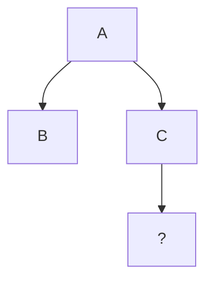
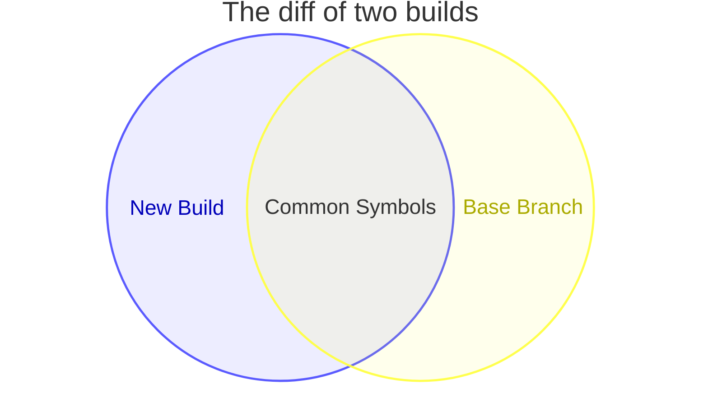
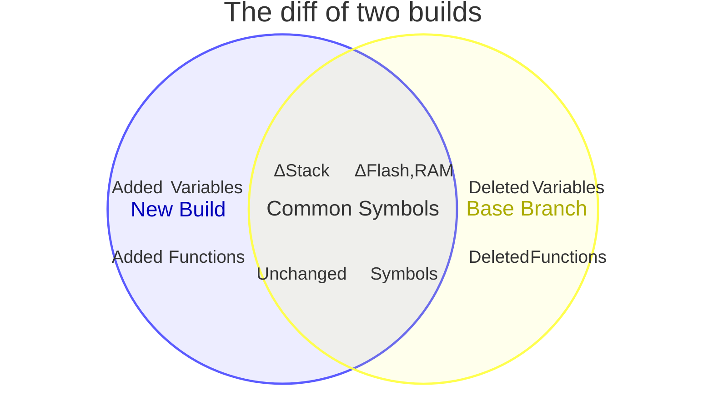
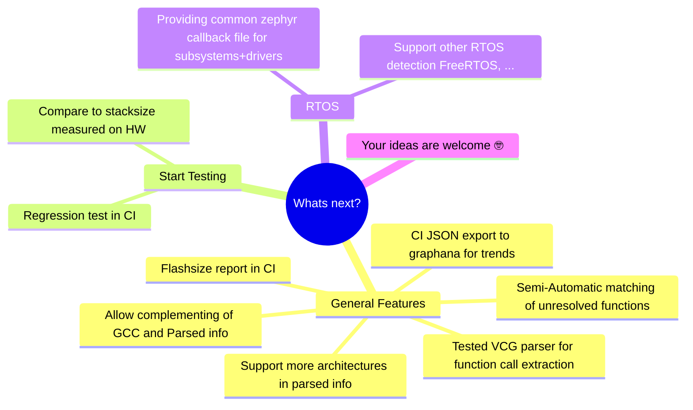

### Tool comparison, stack-usage reports and more

No tool to rule it all...

<small>

| Feature                         | pexplorer+sELFperf              | puncover             | avstack.pl           | zephyr dashboard+<span style="font-size:0.6rem">ROM/RAM</span> report                                                    |
|---------------------------------|---------------------------------|----------------------|----------------------|---------------------------------------------------------------------|
| **Development**                 | 2025-now <br> <small>2000 lines go + 4000 svelte</small>                       | 2014-now  <br> <small>2000 lines python + 500 jinja2</small>            | 2013-2015  <br> <small>200 lines perl</small>           | 2017-now  <br> <small>1500 lines python + 700 jinja2</small>                     |
| **User interface**              | CLI + static web GUI | CLI + web GUI        | CLI                  |  CLI + web GUI      |
| **Memory footprint**            | <v-click at="1"> flash and RAM                                </v-click>    | <v-click at="1"> flash and RAM    </v-click>     | <v-click at="1"> -            </v-click> | <v-click at="1"> flash and RAM              </v-click>    |
| **Firmware scope**              | <v-click at="2"> multiple                                     </v-click>    | <v-click at="2"> single           </v-click>     | <v-click at="2"> single       </v-click> | <v-click at="2"> (multiple with grafana)                                </v-click>     |
| **Analysis scope**              | <v-click at="2"> ELF+DWARF data                                     </v-click>    | <v-click at="2"> ELF data via binutils           </v-click>     | <v-click at="2"> <small>ELF data via binutils</small>       </v-click> | <v-click at="2"> ELF+DWARF data                                </v-click>     |
| **Stack usage**                 | <v-click at="3"> <b>parsing ASM✨ </b>                                  </v-click>    | <v-click at="3"> GCC .su files    </v-click>     | <v-click at="3"> parsing ASM  </v-click> | <v-click at="3">     -                          </v-click>         |
| **Call tree construction**      | <v-click at="3"> parsing ASM <br> <b>dynamic calls config ✨ </b>  </v-click>    | <v-click at="3"> parsing ASM <br> <b>GCC .ci files✨ </b><br> <b>dynamic calls config ✨ </b> </v-click>  | <v-click at="3"> parsing ASM </v-click>   | <v-click at="3">  -    </v-click>   |
| **RTOS awarness**               | <v-click at="3"> <b>static thread detection✨ </b>                      </v-click>    | <v-click at="3"> -                 </v-click>    | <v-click at="3"> -             </v-click> | <v-click at="3">  (nothing memory related)    </v-click>     |
| **Supported architecture**      | <v-click at="3"> ARM / all*                                   </v-click>    | <v-click at="3"> ARM+limited RISCV <br> -> <b>all✨ ([PR!157](https://github.com/HBehrens/puncover/pull/157)) </b></v-click>    | <v-click at="3"> all           </v-click> | <v-click at="3"> all                          </v-click>  |

*only all architectures for memory footprint at the moment


</small>

<!--
| **Interrupt analysis**          | -                               | -                    | -                    |                                             |
including manually added dynamic calls
-->

<style>
    .slidev-layout td, .slidev-layout th {
        padding: 0.2rem;
        padding-top: 0.25rem;
        padding-bottom: 0.25rem;
    }
</style>

<!--
* for some context here an overview of tools
* the 3 tools on the left are integrated in zepyhr
* pexplorer and static ELF perf are experiments helped me get warm with the topic
* there is multiple functions
    * mem footprint mentioned as a big one
    * comparing changes across build another one
* but today is all about the stacks :)
* now we gonna show some of the highlighted topics
-->

---
layout: center
---

# The basics of this kind of firmware analysis

Either

### Evaluating with debug info all stack traces after building the ELF

or

### Construct a calltree with stacksize from GCC output


---
layout: top-title-two-cols
color: dark
title: 'Getting the call graph'
level: 2
---

:: title ::

### Getting the stack sizes - via GCC -fstack-usage

:: left ::

<small style="font-size:70%">Example from [Compile-time stack requirements analysis with GCC](https://www.adacore.com/papers/compile-time-stack-requirements-analysis-with-gcc)</small>

```c
#include <alloca.h>
static void foo (void) { char buffer [1024]; }
static void bar (int n) { void * buffer = alloca (n); }
int main (void) { return 0; }
```


* using ` -fstack-usage` for each compilation unit (.c file) a stack usage (.su) file is generated during compilation next to the object file
* listing all functions in the file and their stack size and wheater it is a limited or static size known during compile time

<small style="font-size:70;padding-top:0px">Example .su file:</small>

```bash
fsu.c:4:foo 1040 static
fsu.c:7:bar 16 dynamic
fsu.c:10:main 32 dynamic,bounded
```

:: right ::

<small style="font-size:70;padding-top:0px">Notes:</small>

* works for all architectures on compiled sources
* linked libraries will not produce .su files...
* is not 100% acurate on all cases:

> /* Make a fair guess for the size of the stack frame of the function in NODE.  This doesn't have to be exact, the result is only used in the inline heuristics.  So we don't want to run the full stack var packing algorithm (which is quadratic in the number of stack vars). Instead, we calculate the total size of all stack vars.  This turns out to be a pretty fair estimate -- packing of stack vars doesn't happen very often. */ <br><br> - gcc/gcc/cfgexpand.cc::estimated_stack_frame_size

---
layout: top-title-two-cols
color: dark
title: Getting the stack sizes
level: 2
---

:: title ::

### Getting the stack sizes - via instruction parsing

:: left ::

<small style="font-size:70%">Assembly extracted from the ELF via objdump or [capstone-engine](https://www.capstone-engine.org/)</small>

```asm {2,4,5}
foo():
  push	{fp}		@ (str fp, [sp, #-4]!)
  add	fp, sp, #0
  sub	sp, sp, #1024	@ 0x400
  sub	sp, sp, #4
  nop
  add	sp, fp, #0
  pop	{fp}		@ (ldr fp, [sp], #4)
  bx	lr

```

* known instructions increasing the stack (i.e. `push` and `sub sp` on ARM) yields stack size
* works on only the ELF with debug symbols
* also works for linked library functions

:: right ::

* architecture dependent - needs to know which instruction(s) move the stack pointer
* needs target architectures `objdump`
* ...or is supported in `capstone` (ARM, ARM64 (ARMv8), BPF, Ethereum VM, M68K, M680X, Mips, MOS65XX, PowerPC, RISC-V, SH, Sparc, SystemZ, TMS320C64X, TriCore, Webassembly, XCore and X86 (16, 32, 64).
* already done in `scripts/checkstack.pl` already for 17 architectures (copy from linux kernel - untouched since 1st zephyr commit  :))


---
layout: top-title-two-cols
color: dark
title: 'Getting the call graph'
hideInToc: true
---

:: title ::

### Getting the call graph - via GCC -fcallgraph-info

:: left ::

```c
typedef void (*Callback)();
typedef struct { char data [128]; Callback cb; } block_t;
block_t global_block;

void c () { block_t local_blocks [2]; global_block->cb(); }
void b (block_t block) { int x; }
void a (){
    int x;
    c ();
    b (global_block);
}
```

<small style="font-size:70%">VCG of example from [Compile-time stack requirements analysis with GCC](https://www.adacore.com/papers/compile-time-stack-requirements-analysis-with-gcc)</small>


```json {5,8,9}
graph: { title: "test.c"
node: { title: "c" label: "c\ntest.c:4:6" }
node: { title: "__stack_chk_fail"
  label: "__stack_chk_fail\n<built-in>" shape : ellipse }
edge: { sourcename: "c" targetname: "__indirect_call" }
node: { title: "b" label: "b\ntest.c:5:6" }
node: { title: "a" label: "a\ntest.c:6:6" }
edge: { sourcename:"a" targetname:"c" label:"test.c:8:5" }
edge: { sourcename:"a" targetname:"b" label:"test.c:9:5" }}
```

:: right ::

<small style="font-size:75;padding-top:0px">Notes:</small>


* using `-fcallgraph-info` for each compilation unit a call info (.ci) file is generated next to the .o file
* .ci uses [VCG format](https://archive.org/details/manualzilla-id-5692621) - a not well supported format, but with some string manipulation it is easy to map it to valid json
* listing all functions and calls in the file
* linked libraries internal calls are missing


```mermaid {theme: 'neutral', scale: 0.5}
graph TD

A
A --> B
A --> C
C --> ?

```


---
layout: top-title-two-cols
color: dark
hideInToc: true
---

:: title ::

### Getting the call graph - via instruction parsing

:: left ::

```asm {1,4,7,11,19}
00000000 c():
   ...

0000001c b():
    ...

00000044 a():
  44:	e92d4810 	push	{r4, fp, lr}
  48:	e28db008 	add	fp, sp, #8
  4c:	e24dd074 	sub	sp, sp, #116	@ 0x74
  50:	ebfffffe 	bl	0 <c>
  54:	e59f4028 	ldr	r4, [pc, #40]	@ 84 <a+0x40>
  58:	e1a0000d 	mov	r0, sp
  5c:	e2843010 	add	r3, r4, #16
  60:	e3a02070 	mov	r2, #112	@ 0x70
  64:	e1a01003 	mov	r1, r3
  68:	ebfffffe 	bl	0 <memcpy>
  6c:	e894000f 	ldm	r4, {r0, r1, r2, r3}
  70:	ebfffffe 	bl	1c <b>
  74:	e1a00000 	nop			@ (mov r0, r0)
  78:	e24bd008 	sub	sp, fp, #8
  7c:	e8bd4810 	pop	{r4, fp, lr}
  80:	e12fff1e 	bx	lr

```


:: right ::

<small style="font-size:75;padding-top:0px">Notes:</small>


* known call instructions (i.e. `b*` `bl*` and `blx*` on ARM) yields static functions calls
* works on only the ELF with debug symbols
* also works for linked library functions
* architecture dependent - needs to know which instruction(s) call a function and how exactly
* needs target architectures `objdump` or support in `capstone`

---
hideInToc: true
---

### Wrapping it up

* only working on a debug symbol ELF is most portable and compiler independent
* using GCC output is architecture independent but other compilers miss options

<table class="tg"><thead>
  <tr>
    <th class="tg-0pky"></th>
    <th class="tg-0pky"></th>
    <th class="tg-c3ww" colspan="2">Stack use for each function by...</th>
  </tr></thead>
<tbody>
  <tr>
    <td class="tg-0pky"></td>
    <td class="tg-0pky"></td>
    <td class="tg-0pky">...parsing the assembly instructions.</td>
    <td class="tg-0pky">...reading GCC .su files.</td>
  </tr>
  <tr>
    <td class="tg-0pky" rowspan="2">Function calls extracted by...</td>
    <td class="tg-0pky">...parsing the assembly instructions.</td>
    <td class="tg-c3ow">pexplorer</td>
    <td class="tg-c3ow">puncover</td>
  </tr>
  <tr>
    <td class="tg-0pky">...reading GCC .ci files.</td>
    <td class="tg-c3ow"></td>
    <td class="tg-c3ow">(puncover !157) / (pexplorer?)</td>
  </tr>
</tbody>
</table>


<style type="text/css">
.tg  {border-collapse:collapse;border-spacing:0;}
.tg td{border-color:black;border-style:solid;border-width:1px;font-family:Arial, sans-serif;font-size:14px;
  overflow:hidden;padding:10px 5px;word-break:normal;}
.tg th{border-color:black;border-style:solid;border-width:1px;font-family:Arial, sans-serif;font-size:14px;
  font-weight:normal;overflow:hidden;padding:10px 5px;word-break:normal;}
.tg .tg-c3ow{border-color:inherit;text-align:center;vertical-align:top; height: 100px;vertical-align: middle;}
.tg .tg-c3ww{border-color:inherit;text-align:center;vertical-align:top; }
.tg .tg-0pky{border-color:inherit;text-align:left;vertical-align:top;vertical-align: middle;}
</style>

---
layout: center
title: 'pexplorer features - footprints, diff, RTOS, config'
---


---
layout: center
---


---


---

<v-switch>
  <template #0>


```mermaid
venn-beta
  title The diff of two builds
  set NewFeatureBuild["New Build"]:20
  set TargetBranch["Base Branch"]:20
  union NewFeatureBuild,TargetBranch["Common Symbols"]:10
```

</template>
  <template #1>


```mermaid
venn-beta
title The diff of two builds
set NewFeatureBuild["New Build"]:20
    text x["Added"]
    text A1["Variables"]
    text x["Added"]
    text A1["Functions"]
set TargetBranch["Base Branch"]:20
    text x["Deleted"]
    text A1["Variables"]
    text x["Deleted"]
    text A1["Functions"]
union NewFeatureBuild,TargetBranch["Common Symbols"]:10
    text AB3["ΔStack"]
    text AB3["ΔFlash,RAM"]
    text AB1["Unchanged"]
    text AB2["Symbols"]

```

   </template>
</v-switch>


---


---
layout: top-title-two-cols
hideInToc: true
---

:: title ::

# Reading static zephyr structs

<v-switch>
<template #0>


</template>
<template #1>
</template>
</v-switch>

:: left ::


<v-clicks>

* K_THREAD_DEFINE'd threads are stored in the `_static_thread_data_area` section
* iterate over all variables, check if it is in the `_static_thread_data_area` section
* if yes, read the bytes from the ELF
* map the bytes to the `_static_thread_data` struct

</v-clicks>


:: right ::


<v-clicks>

<v-switch>
<template #0>

</template>
<template #1>


```c
struct _static_thread_data {
	struct k_thread *init_thread;
	k_thread_stack_t *init_stack;
	unsigned int init_stack_size;
	k_thread_entry_t init_entry;
	void *init_p1;
	void *init_p2;
	void *init_p3;
	int init_prio;
	uint32_t init_options;
	const char *init_name;
};
```


<v-clicks>

* look-up `init_name`, `init_stack` and `init_entry` to get pointers to the thread entry function, name, ...
* similar with statically initialized stacks looking for type `z_thread_stack_element`


</v-clicks>

</template>
</v-switch>

</v-clicks>


---
layout: center
hideInToc: true
---


---
layout: top-title-two-cols
color: dark
hideInToc: true
---

:: title ::

### Why are unresolved indirect / dynamic calls distorting the results?

:: left ::


<v-click at="3">


</v-click>

:: right ::

<v-clicks>

* 16 functions unresolved...
* ...add a user provided callback :)


* calltree got completer...
* ...thread stack size increased

</v-clicks>


---
title: Outlook
---

### Outlook - Whats next?


```mermaid
mindmap
  root((Whats next?))
    General Features
      Flashsize report in CI
      Semi-Automatic matching of unresolved functions
      Tested VCG parser for function call extraction
      CI JSON export to graphana for trends
      Allow complementing of GCC and Parsed info
      Support more architectures in parsed info
    Start Testing
      Regression test in CI
      Compare to stacksize measured on HW
    RTOS
      Providing common zephyr callback file for subsystems+drivers
      Support other RTOS detection FreeRTOS, ...
    Your ideas are welcome 🤓


```

---
layout: center
hideInToc: true
---

### Thank you for your attention!

#### Any questions, proposals and feedback are very welcome :)

<br>
<div class="flex flex-wrap">
  <div class="w-1/3">
    <small>pexplorer+selfperf</small>
    <QRCode value="https://paulwuertz.github.io/pexplorer/" :size="160" render-as="svg" />
  </div>
  <div class="w-1/3">
    <small>CI PR/MR comments</small>
    <QRCode value="https://github.com/CANnectivity/cannectivity/pull/259/changes" :size="160" render-as="svg" />
  </div>
  <div class="w-1/3">
    <small>puncover-fork</small>
    <QRCode value="https://github.com/paulwuertz/puncover/" :size="160" render-as="svg" />
  </div>
</div>
<br>
<div class="flex flex-wrap ">
  <div class="w-1/6"></div>
  <div class="w-1/3">
    <small>try pexplorer :)</small>
    <QRCode value="https://github.com/paulwuertz/pexplorer/" :size="160" render-as="svg" />
  </div>
  <div class="w-1/3">
    <small>presentation slides</small>
    <QRCode value="https://paulwuertz.github.io/static_firmware_analysis_presentations_slides/" :size="160" render-as="svg" />
  </div>
</div>
